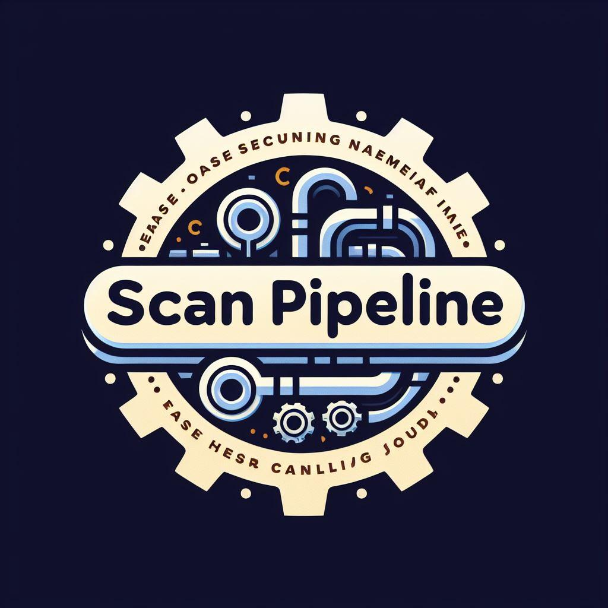

# Scan Pipeline

Scan Pipeline offers a streamlined solution for managing scanned documents, enabling you to efficiently rename, organize, and manipulate files as they are scanned into your system. Whether you're digitizing archives or handling daily paperwork, Scan Pipeline simplifies the process with its intuitive features.



## Features

- **Automatic Queue Updates**: Continuously monitors the input folder for newly scanned files, updating the queue in real-time.
- **File Renaming**: Rename scanned documents individually, providing custom names for enhanced organization.
- **File Manipulation**: Rotate or delete scanned images directly within the application for quick adjustments.
- **Intuitive Interface**: User-friendly interface designed for seamless navigation and operation.

## Getting Started

Scan Pipeline offers hassle-free setup, available across Windows, Linux, and macOS platforms.

### Pre-built Binaries

1. **Download**: Visit the [Releases](https://github.com/scan-pipeline/releases) page on GitHub to download the appropriate binary for your operating system.
2. **Installation**: Unzip the downloaded file and run Scan Pipeline directly without any installation process.

### Building from Source

For advanced users or customization needs, Scan Pipeline's source code is available on GitHub.

1. **Clone the Repository**: Clone the Scan Pipeline repository to your local machine using Git.

    ```bash
    git clone https://github.com/scan-pipeline/scan-pipeline.git
    ```

2. **Install Dependencies**: Ensure Python is installed, navigate to the repository directory, and install dependencies via pip.

    ```bash
    pip install -r requirements.txt
    ```

3. **Build Executable**: Use PyInstaller to create a standalone executable tailored to your platform.

    ```bash
    pyinstaller --noconfirm --onefile --windowed --icon "path/to/scan_pipeline_logo_icon.ico" --add-data "path/to/scan_pipeline_logo.jpeg;."  "path/to/scan_pipeline.py"
    ```

4. **Alternative**: Utilize Auto Py to Exe for a simpler build process using the provided configuration file. (`auto-py-to-exe scan pipeline onefile.json`)

Customize the paths in the commands above according to your setup.

**Note**: On macOS be sure to omit the splash screen and use the `.icns` icon instead of the `.ico` icon.

## Usage

1. **Monitor Input Folder**: Scan Pipeline automatically detects new files in the input folder, updating the queue in real-time.
2. **Rename or Manipulate**: Select a file from the queue to rename it or perform manipulations like rotation or deletion.
3. **Customize Names**: Enter desired names for scanned documents, ensuring clarity and organization.
4. **Sequential Operation**: Process files in the order they are scanned, maintaining a systematic approach.
5. **Track Progress**: Monitor queue status to keep track of pending tasks and completed operations.
6. **Efficient Workflow**: Achieve efficiency in managing scanned documents with Scan Pipeline's intuitive workflow.

## Contribution

Contributions to Scan Pipeline are encouraged! Whether it's bug fixes, new features, or enhancements, feel free to contribute by forking the repository and submitting pull requests.

## License

Scan Pipeline is licensed under the GNU General Public License v3.0 (GPL-3.0). See the [LICENSE](LICENSE) file for details.
